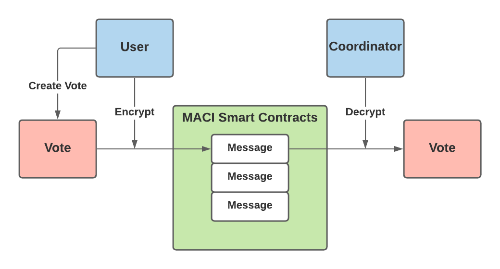
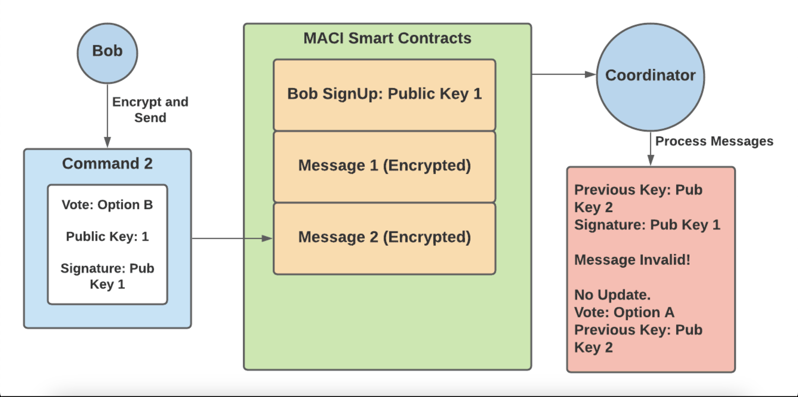
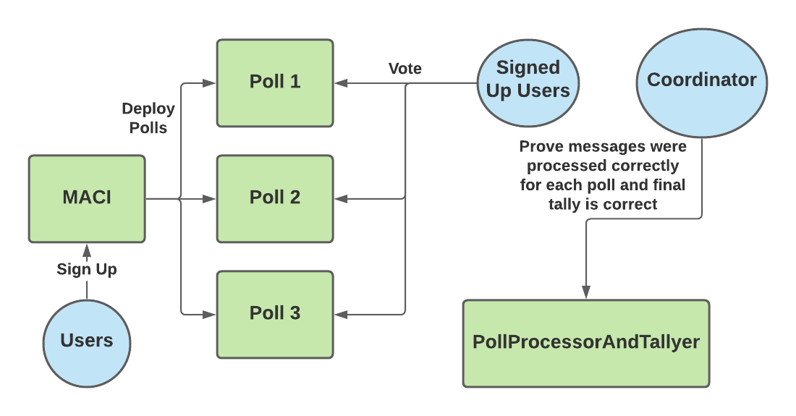
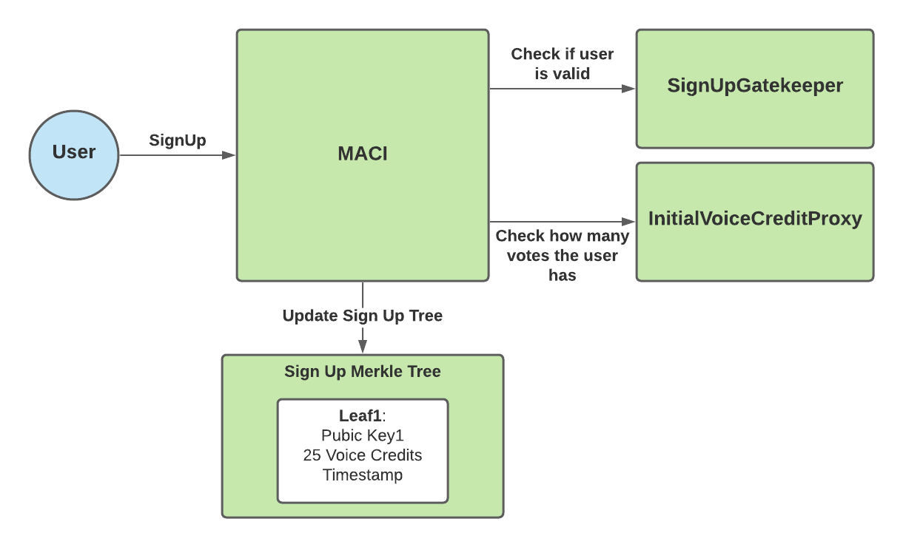

# A Technical Introduction to MACI 1.0

## Introduction

MACI, which stands for Minimal Anti-Collusion Infrastructure, is an application that allows users to have an on-chain voting process with greatly increased collusion resistance. A common problem among today’s on-chain voting processes is how easy it is to bribe voters into voting for a particular option. Oftentimes this bribery takes the form of “join our pool (vote our way) and we will give you a cut of the rewards (the bribe)”. Since all transactions on the blockchain are public, without MACI, voters can easily prove to the briber which option they voted for and therefore receive the bribe rewards.

MACI counters this by using zk-SNARKs to essentially hide how each person voted while still revealing the final vote result. User’s cannot prove which option they voted for, and therefore bribers cannot reliably trust that a user voted for their preferred option. For example, a voter can tell a briber that they are voting for option A, but in reality they voted for option B. There is no reliable way to prove which option the voter actually voted for, so the briber does not have the incentive to pay voters to vote their way.

## Background

For a general overview, the history and the importance of MACI, see Release Announcement: MACI 1.0 by Wei Jie, one of the creators. He also created a very helpful youtube video on the overview of MACI. To see the origin of the idea of MACI, see Vitalik’s research post on Minimal Anti-Collusion Infrastructure. Lastly, it is recommended to understand the basic idea behind zk-SNARKs, as these are a core component of MACI. The following articles are great resources:

- Introduction to zk-SNARKs — Consensys
- What are zk-SNARKs — Zcash
- An approximate introduction to how zk-SNARKs are possible — Vitalik
- zkSNARKs in a nutshell — Ethereum.org

This article will go over the general workflow of MACI and how it is capable of providing the following tenets (taken word for word from Wei Jie’s article):

- Collusion Resistance: No one except a trusted coordinator should be certain of the validity of a vote, reducing the effectiveness of bribery
- Receipt-freeness: No voter may prove (besides to the coordinator) which way they voted
- Privacy: No one except a trusted coordinator should be able to decrypt a vote
- Uncensorability: No one (not even the trusted coordinator) should be able to censor a vote
- Unforgeability: Only the owner of a user’s private key may cast a vote tied to its corresponding public key
- Non-repudiation: No one may modify or delete a vote after it is cast, although a user may cast another vote to nullify it
- Correct execution: No one (not even the trusted coordinator) should be able to produce a false tally of votes

## System Overview

### Roles

In the MACI workflow, there are two different roles: users (voters) and a single trusted coordinator. The users vote on the blockchain via MACI smart contracts, and the coordinator tallies up the votes and releases the final results.

The coordinators must use zk-SNARKs to prove that their final tally result is valid without releasing the vote of every individual. Therefore, even if a coordinator is corrupt, they are unable to change a user’s vote or add extra votes themselves. A corrupt coordinator can stop a vote by never publishing the results, but they can’t publish false results.

Before sending their vote on the blockchain, users encrypt their vote using a shared key that only the user and coordinator can know. This key scheme is designed so that every individual user shares a distinct key with the coordinator. This prevents any bribers from simply reading the transaction data to see which option a user voted for. The encrypted vote is now considered a “message” and the user sends this message to a MACI smart contract to be stored on-chain.

A very simplified illustration of this encryption can be seen below:

### Vote Overriding and Public Key Switching

Before a user can cast a vote, they must sign up by sending the public key they wish to use to vote to a MACI smart contract. This public key acts as their identity when voting. They can vote from any address, but their message must contain a signature from that public key. When casting an actual vote after signing up, a user will bundle a few variables — including a public key, their vote option, their vote amount, and a few others — into what is called a “command”. Then, the user signs the command with the public key they originally used to sign up. After that, the user encrypts the signature and command together so that it is now considered a message. This more complex description of how a message is constructed is illustrated below:

Users are able to override their previous vote as long as they sign their command with the previous public key. If the command is properly signed by the user’s previous public key, then the message is considered valid and the coordinator will count this as the correct vote. So, when a user provides a public key in their vote that is different than their previous public key, they may now submit a new vote signed by this new public key to override their previous vote. If the signature is not from the previous public key, the message will be marked as invalid and not counted toward the tally. Therefore, the public key can be thought of as the user’s voting username, and the signature is the voting password. If they provide the correct signature, they can submit a vote or change their public key — or both.

This feature, which I refer to as public key switching, is designed to counter the bribery attack where a user simply shows the briber their message, and then decrypts it for the briber to see which way the user voted. Public key switching allows users to change their public key and create invalid messages in favor of the bribers. The bribers have no way of telling if the user switched their public keys before sending in the vote shown to the bribers.

This can be quite confusing so here is an example:

1. Bob signs up with public key 1
2. Bob then creates a command that contains — a vote for option A and public key 2
3. Bob signs this command with public key 1, the key he used to sign up
4. Bob encrypts this command into a message and submits it to the MACI smart contracts
5. The coordinator decrypts this message, and checks to ensure that the command is signed by Bob’s previous key — public key 1. This message is valid.
6. The coordinator then records Bob’s vote for option A and updates his public key to public key 2

At this point, Bob has successfully voted for option A, and in order to override this vote must send in a new vote with a signature from public key 2. At this point, a briber now tries to get Bob to vote for option B:

1. Bob creates a command that contains — a vote for option B and public key 1
2. Bob signs this command with public key 1, encrypts the message and submits it to the MACI smart contracts
3. Bob shows the briber the decrypted message as proof of his vote for option B
4. The coordinator decrypts Bob’s message and sees that the signature does not match up with public key 2 — Bob’s previous key added in his previous message. Therefore this message is invalid and this vote is not counted in the final tally.
5. The briber has no way of knowing whether the vote was valid or invalid, and so is not incentivized to offer bribes to other users.

In order to get a good idea of how MACI works, it’s important to know how the zk-SNARKs are able to prove that the coordinator decrypted each message and tallied the votes properly. The next section gives a quick and much oversimplified overview of zk-SNARKs, although the readings listed in the introduction are much more helpful.

### zk-SNARKs

Essentially, zk-SNARKs allow users to prove they know an answer to a specific mathematical equation, without revealing what that answer is. Take the following equation for example,

> X + Y = 15

I can prove that I know 2 values, X and Y that satisfy the equation without revealing what those two values are. When I create a zk-SNARK for my answer, anyone can use the SNARK (a group of numbers) and validate it against the equation above to prove that I do know a solution to that equation. The user is unable to use the SNARK to find out my answers for X and Y.

For MACI, the equation is much more complicated but can be summarized as the following equations:

> encrypt(command1) = message1  
> encrypt(command2) = message2  
> encrypt(command3) = message3  
> …  
> Command1 from user1 + command2 from user2 + command3 from user3 + … = total tally result

Here, everyone is able to see the messages on the blockchain and the total tally result. Only the coordinator knows what the individual commands/votes are by decrypting the messages. So, the coordinator uses a zk-SNARK to prove they know all of the votes that:

1. Encrypt to the messages present on the blockchain
2. Sum to the tally result
   Users can then use the SNARK to prove that the tally result is correct, but cannot use it to prove any individual’s vote choices.

Now that the core components of MACI have been covered, it is helpful to dive deeper into the MACI workflow and specific smart contracts.

## Workflow

The general workflow process can be broken down into 4 different phases:

1. Sign Up
2. Publish Message
3. Process Messages
4. Tally Results

These phases make use of 3 main smart contracts — MACI, Poll and ​​PollProcessorAndTallyer. These contracts can be found on the MACI github page. The MACI contract is responsible for keeping track of all the user signups by recording the initial public key for each user. When a vote is going to take place, users can deploy a Poll smart contract via MACI.deployPoll().

The Poll smart contract is where users submit their messages. One MACI contract can be used for multiple polls. In other words, the users that signed up to the MACI contract can vote on multiple issues, with each issue represented by a distinct Poll contract.

Finally, the PollProcessorAndTallyer contract is used by the coordinator to prove on-chain that they are correctly tallying each vote. This process is explained in more detail in the Process Messages and Tally Results sections below.

### Sign Up

The sign up process for MACI is handled via the MACI.sol smart contract. Users need to send three pieces of information when calling MACI.signUp():

1. Public Key
2. Sign Up Gatekeeper Data
3. Initial Voice Credit Proxy Data

The public key is the original public key mentioned in above sections that the user will need to vote. As explained in earlier sections, they can change this public key later once voting starts. The user’s public key used to sign up is shared amongst every poll.

MACI allows the contract creator/owner to set a “signUpGateKeeper”. The sign up gatekeeper is meant to be the address of another smart contract that determines the rules to sign up. So, when a user calls MACI.signUp(), the function will call the sign up gatekeeper to check if this user is valid to sign up.

MACI also allows the contract creator/owner to set an “initialVoiceCreditProxy”. This represents the contract that determines how many votes a given user gets. So, when a user calls MACI.signUp(), the function will call the initial voice credit proxy to check how many votes they can spend. The user’s voice credit balance is reset to this number for every new poll.

Once MACI has checked that the user is valid and retrieved how many voice credits they have, MACI stores the following user info into the Sign Up Merkle Tree:

1. Public Key
2. Voice Credits
3. Timestamp

### Publish Message

Once it is time to vote, the MACI creator/owner will deploy a Poll smart contract. Then, users will call Poll.publishMessage() and send the following data:

1. Message
2. Encryption Key

As explained in sections above, the coordinator will need to use the encryption key in order to derive a shared key. The coordinator can then use the shared key to decrypt the message into a command, which contains the vote.

Once a user publishes their message, the Poll contract will store the message and encryption key into the Message Merkle Tree.

### Process Messages

Once the voting is done for a specific poll, the coordinator will use the PollProcessAndTallyer contract to first prove that they have correctly decrypted each message and applied them to correctly create an updated state tree. This state tree keeps an account of all the valid votes that should be counted. So, when processing the messages, the coordinator will not keep messages that are later overridden by a newer message inside the state tree. For example, if a user votes for option A, but then later sends a new message to vote for option B, the coordinator will only count the vote for option B.

The coordinator must process messages in groups so that proving on chain does not exceed the data limit. The coordinator then creates a zk-SNARK proving their state tree correctly contains only the valid messages. Once the proof is ready, the coordinator calls PollProcessorAndTallyer.processMessages(), providing a hash of the state tree and the zk-SNARK proof as an input parameters.

The PollProcessorAndTallyer contract will send the proof to a separate verifier contract. The verifier contract is specifically built to read MACI zk-SNARK proofs and tell if they are valid or not. So, if the verifier contract returns true, then everyone can see on-chain that the coordinator correctly processed that batch of messages. The coordinator repeats this process until all messages have been processed.

### Tally Votes

Finally, once all messages have been processed, the coordinator tallies the votes of the valid messages. The coordinator creates a zk-SNARK proving that the valid messages in the state tree (proved in Process Messages step) contain votes that sum to the given tally result. Then, they call PollProcessorAndTallyer.tallyVotes() with a hash of the correct tally results and the zk-SNARK proof. Similarly to the processMessages function, the tallyVotes function will send the proof to a verifier contract to ensure that it is valid.

The tallyVotes function is only successful if the verifier contract returns that the proof is valid. Therefore, once the tallyVotes function succeeds, users can trust that the coordinator has correctly tallied all of the valid votes. After this step, anyone can see the final tally results and the proof that these results are a correct result of the messages sent to the Poll contract. The users won’t be able to see how any individual voted, but will be able to trust that these votes were properly processed and counted.

## Conclusion

MACI is a huge step forward in preventing collusion for on-chain votes. While it doesn’t prevent all possibilities of collusion, it does make it much harder. MACI can already be seen to be in use by the clr.fund, which has users vote on which projects to receive funding. When the possible funding amount becomes very large, users and organizations have a large incentive to collude to receive parts of these funds. This is where MACI can truly make a difference, to protect the fairness of such important voting processes such as those at clr.fund.
